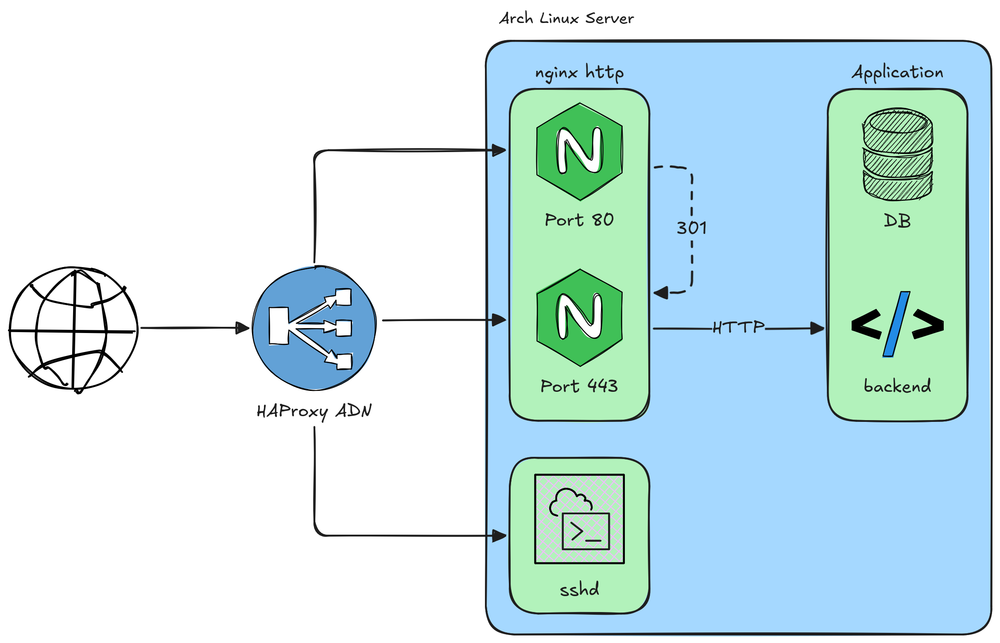

Since Arch Linux is the continued target of DDoS attacks (see the [related
announcement][service-outage-announcement]) by all technical means we have
evaluated a lot of different providers mostly regarding the following
requirements:

- No need to terminate TLS with $vendor / ensure end-to-end encryption from the
  User to our service
- Ability to also work with non-HTTP traffic such as TCP/22 for SSH on the AUR
- Reasonable to no costs
- Technical feasibility (i.e. no need to bring our own IP subnet etc.)
- Minimize impact for legitimate user, i.e. ensure continued service
  reachability even for countries under sanction

As it turns out this is a rather scarce field with regards to possible
providers, as most either service enterprise customers and work more on BGP
level and others only do CDN-type setups which force TLS termination and are
not suited for protocols other than HTTP(S).

Below you can find more information on the solution that we went for in the
end.

# HAProxy Application Delivery Network

## Architecture and background information

- **IP rewrite & nginx rate limiting:** We are using the [nginx realip
  module][nginx-realip-module] to re-add the source IP of the request back to
  the proxied data. The tricky thing here is that the full list of all proxies
  needs to be declared trusted in nginx in order to make the rewriting work
  (which is different from the Hetzner Load Balancer case as its only ever one
  IP that we need to rewrite from) and the IPs for this are stored in
  `vault_proxy_vendor_ips.yml` and might periodically need refreshing.
  With this in place both logging and nginx rate limiting should work with the
  regular configuration options.
- **`proxy_protocol`:** HAProxy sends us the forwarded requests with the source
  IP preserved in form of the [`proxy_protocol`][proxy-protocol-info]. In
  consequence we have to teach nginx how to [accept the proxy
  protocol][nginx-proxy-protocol], as this is incompatible with a regular
  `listen` directive in nginx. A service can listen for both `proxy_protocol`
  and regular traffic, but then one of the two `listen` directives has to be bound
  to a specific interface. Most of this logic is abstracted away in the
  `listen-*.conf` snippets as part of the `nginx` Ansible role.
- **fail2ban:** Since our regular `fail2ban` remediation logic is based on the
  fact that the client is connecting to us directly and we can just ban via a
  ipset in firewalld this does not work for us anymore. Instead (this is still
  ongoing work) we tunnel the incoming TCP traffic through a nginx `stream
  {...}` directive, which we then populate with `deny XXX.XXX.XXX.XXX;` entries
  from `fail2ban`. Additionally we need to allowlist the IPs of the ADN proxies
  in order to not lock the users of a certain point of presence out on
  accident.

## Setting up a service

**Preparation:**

1. **Floating IPs:** In order to give HAProxy a stable IP for the setup of
   their service we reserve a new Floating IP for the server. After then
   switching behind the ADN Proxy we rotate the IPs so that the attackers can
   not go for the backend directly. This reservation can be done with the
   `floating_ipv6 = true` argument in `archlinux.tf` and the resulting floating
   IPs need to be added to the `additional_addresses` hostvar and rolled out
   via the `common` role.
1. **ADN Ticket:** By going through the [New ADN Property][new-adn-property]
   form one can create a new service on the Application Delivery Network. Note
   that we want to only create a TCP forwarding without being SSL involved on
   the HAProxy side as we keep terminating TLS ourselves. For services that
   support it (i.e. currently anything behind nginx) also ask for
   [`proxy_protocol`][proxy-protocol-info] to be enabled to preserve initial
   clients IPs. This setup requires some manual checking on their side, so it
   is not instant and therefore should be prepared beforehand for any service
   that proved to be at risk. After the creation HAProxy will respond with the
   setup details like the fronting IPv4 and IPv6 addresses. See
   [`MSK-481-77696`][adn-property-example-ticket] for an example ticket.

**Setup:**

1. **Inventory & vault changes:** After reserving the Floating IPs in the
   preparation setup the interface assignments need to be persisted for the
   machine by using the `additional_addresses` variable from a newly created
   vault, since the backend IPs can not be public. In order to not rely on
   HAProxy working for management access(and since most services will not
   expose SSH via HAProxy) it also makes sense to set `ansible_host` to the
   floating IP assignment in the same vault.
1. **IP address rotation:** So far there is no way to do this by purely
   automated means, hence here is a rough description of the clickops'ed
   workflow:
   1. For each Floating IP on the server, disable protection and unassign it.
   1. For each Primary IP on the server, disable protection and unassign it
      (unassigning ensures that we actually get new IPs).
   1. Disable and re-enable public networking on the server.
   1. Turn the server back on and fix the IP address entries in Ansible
      `host_vars`.
   1. Make `terraform` happy again by removing the previous rdns entries from
      the state: `terraform state rm 'hcloud_rdns.rdns_ipv4["archlinux.org"]'`.
   1. Force wireguard re-peering by running `ip link delete wg0 && networkctl
      reload` (see the related [issue][wireguard-repeering-systemd-issue])
   1. Figure out all other gnarly dependencies on the IP in question, i.e.
      allowlists in some rsyncd conf or firewall entries.
1. **nginx Change**: Most of the logic is already implemented in Ansible, so
   it's mostly about the following two changes:
   - Ensure that the nginx config of the service already uses the
     `snippets/listen-*.conf`.
   - Set `nginx_proxy_vendor: haproxy` in the `host_vars`.
   - Deploying the service role (i.e. `aurweb`) aswell as the `nginx` and
     `fail2ban` roles.
1. **DNS Change:** After all is ready the DNS can be set to the HAProxy
   provided addresses.

## Services currently running behind HAProxy ADN

HAProxy has made some measurements on what regular traffic and irregulars are
and recommended the some rate limits for our services after checking with us.

The effects of these limits can be seen on the [WAF Realtime
Overview][waf-overview] under the "WAF Attack Breakdown" section. If a single
IP needs to be investigated this is possible on the [WAF Details
Page][waf-details], especially under the "IPs" section.

- `archlinux.org`
   - https: 200
   - http: 20
- `aur.archlinux.org`
   - https: 50
   - http: 25
   - ssh: 25
- `man.archlinux.org`
   - https: 200
   - http: 20
- `wiki.archlinux.org`
   - https: 200
   - http: 20
- `test.pkgbuild.com`

The unit of these limits is the amount of allowed connections per moving 10
second window per IP.

Additionally HAProxy has implemented request queuing for ASNs and specific
traffic origins that frequently are the source of DDoS attacks, so far this has
only been activiated for traffic coming from proxy networks. The queuing system
scores traffic internally and tries to give higher priority to all traffic that
is most likely not malicious.

[service-outage-announcement]: https://archlinux.org/news/recent-services-outages/
[waf-overview]: https://my.haproxy.com/portal/cust/index#summary/waf_realtime
[waf-details]: https://my.haproxy.com/portal/cust/index#summary/analytics?type=WAF&tab_key=Security
[new-adn-property]: https://my.haproxy.com/portal/cust/index#summary/adn_request_form
[adn-property-example-ticket]: https://my.haproxy.com/portal/cust/index#view_ticket?ticketid=MSK-481-77696
[proxy-protocol-info]: https://www.haproxy.com/blog/use-the-proxy-protocol-to-preserve-a-clients-ip-address
[nginx-proxy-protocol]: https://docs.nginx.com/nginx/admin-guide/load-balancer/using-proxy-protocol/
[nginx-realip-module]: https://nginx.org/en/docs/http/ngx_http_realip_module.html
[wireguard-repeering-systemd-issue]: https://github.com/systemd/systemd/issues/9911
